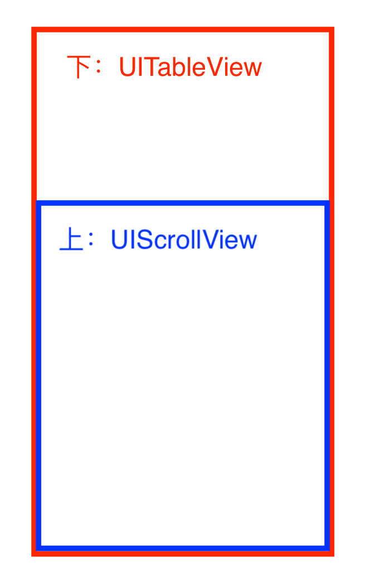

# JRLinkageEffect
UITableView和UIScrollView的联动效果演示程序

#### 框架分析：
- 下边是一个视频列表(UITableView)
- 上边是一个半透明的滚动视图(UIScrollView)

#### 实现思路：
- 联动效果：滚动UIScrollView时，UITableView随之滚动；滚动UITableView时，UIScrollView随之滚动。
- 联动关键代码：

- 分页效果：滑动UIScrollView或UITableView，滚动停止后，修正UITableView的contentOffSet. (注意：UIScrollView的contentSize的height应为UITableView的contentSize的height减去一个cell的height)
- 分页关键代码：

- 加载数据：为UITableView和UIScrollView同时添加刷新控件，并设置UIScrollView的刷新控件字体颜色为透明色。使用KVO监听UITableView和UIScrollView的刷新控件状态的变化，如果其中有一个发生变化，就更新另一个的状态，使UITableView和UIScrollView的刷新控件状态保持一致。此外还要监听UITableView的contentSize，据此变化去更新UIScrollView的contentSize。(注：这里使用的刷新控件为MJRefresh)
- 加载数据关键代码：

